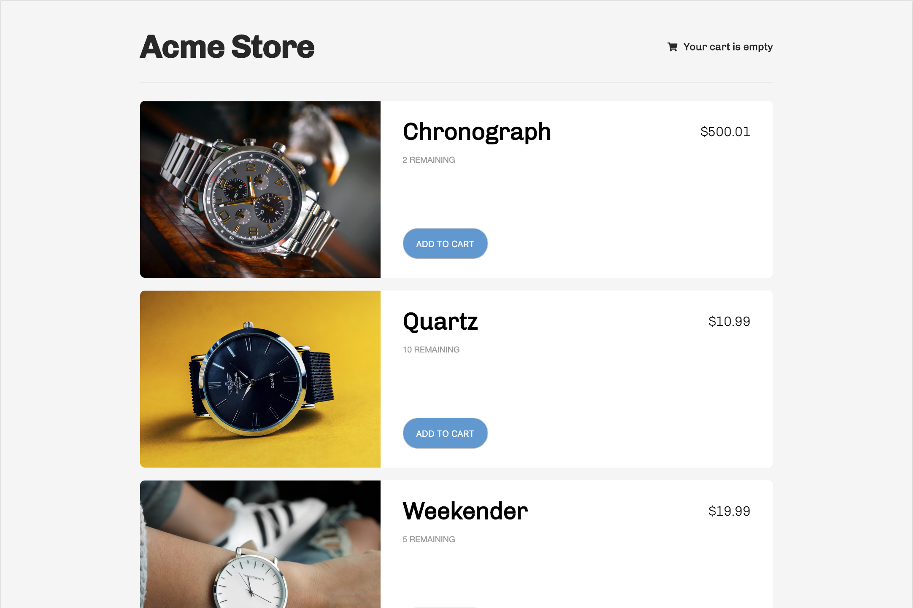
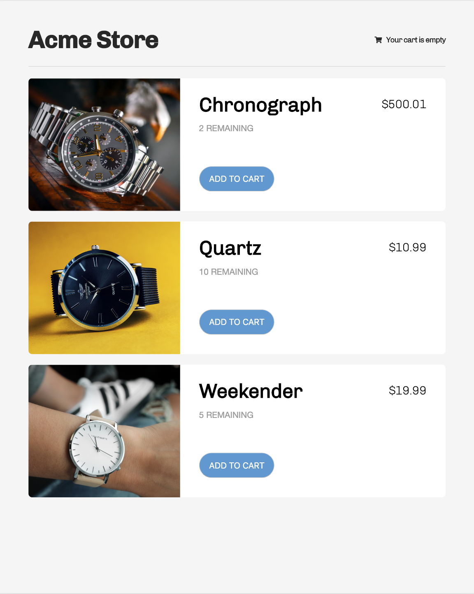
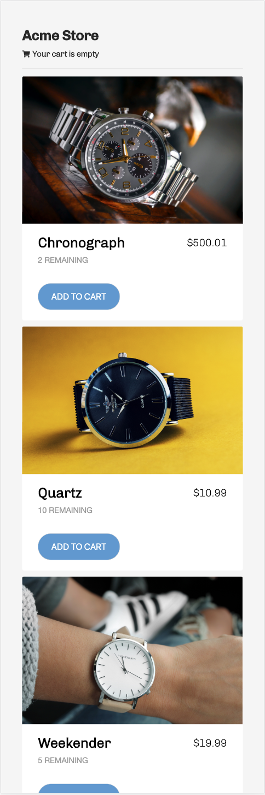

# React-Redux Shopping Cart
This is a copy of the [Redux Shopping Cart Example](https://github.com/reactjs/redux/tree/master/examples/shopping-cart).

A shopping cart component that utilizes responsive design to provide seamless user-experience to all users across all devices.

## Features & Implementation
Instead of using regular css, I decided to use node-sass. The reasons why I went with node-sass are the following:
+ Scalable
+ Readable
+ Separation of concerns
+ Easier to maintain

### Breakpoints
| Breakpoints       | Width (in px) | Screenshot   |
| ----------------- |:-------------:| ------------ |
| Desktop/Laptop    | 1200+         |  |
| Tablet            | 600 - 900     |    |
| Mobile            | 0 - 600       |    |


### Files Structure
Everything is written in a partial in their own respective files and folders. This makes it easier for the next developer to maintain, and to scale as this component/app gets bigger.


## Setup
To install dependencies, use the package manager [Yarn](https://yarnpkg.com/en/):
```
yarn
```

To start a development server, run command:
```
yarn start
```

To edit SASS files, please open a new terminal tab/window and run command
```
yarn compile:sass
```

## Technologies
+ React
+ Redux
+ node-sass


